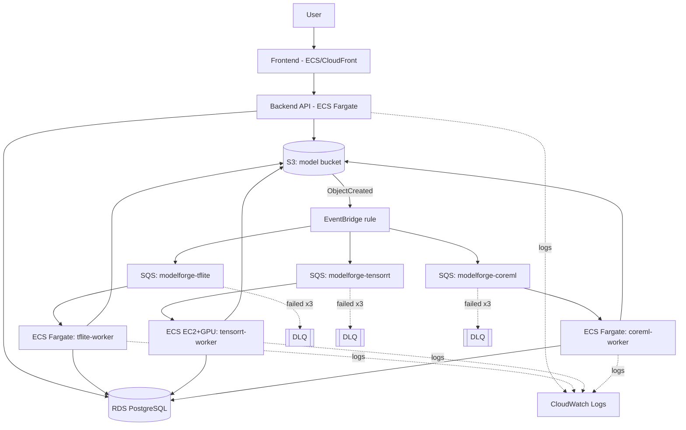

# AWS Production Architecture

This directory documents the production topology that `AWS_MODE=aws` targets. The
Terraform in `infrastructure/terraform/` provisions it; **nothing here is applied
automatically** — running `terraform apply` creates billable AWS resources and must be
a deliberate, reviewed action.

## Why EventBridge sits between S3 and SQS

Routing through an EventBridge rule (rather than S3 → SQS notifications directly) is
what lets all three format queues subscribe to the same `ObjectCreated` event
independently, and lets new formats be added later as pure additive EventBridge targets
with no change to the upload path.

## Component notes

| Component | Purpose | Key file |
|---|---|---|
| S3 bucket | `models/{user_id}/{model_id}/{original,onnx,converted,benchmarks,logs}/` | `main.tf` |
| EventBridge rule | Matches `models/**/onnx/model.onnx` uploads | `main.tf` |
| SQS + DLQ (×3) | One isolated queue per format; 3 retries before DLQ | `modules/queue_with_dlq` |
| ECS Fargate (backend, tflite, coreml) | CPU-only workloads | `ecs.tf` |
| ECS EC2 + GPU capacity provider | TensorRT builds require an NVIDIA GPU | `ecs.tf` |
| RDS PostgreSQL | Jobs, models, benchmarks, logs | `main.tf` |
| ECR (×5) | backend, frontend, and the 3 worker images | `main.tf` |
| IAM | One task role per worker, scoped to only its own queue | `iam.tf` |
| CloudWatch Logs | One log group per service, 30-day retention | `main.tf` |

## Local mock mode maps 1:1 onto this

| Production | Local (`AWS_MODE=mock`) |
|---|---|
| S3 | `LocalStorageProvider` writing under `LOCAL_STORAGE_ROOT` |
| EventBridge + SQS | `LocalQueueProvider` (in-process `queue.Queue` per format) |
| ECS task | A daemon thread spawned by `LocalJobExecutor` |
| RDS | The same PostgreSQL container from `docker-compose.yml` |

Every provider is selected by `app/*/factory.py` based on `AWS_MODE`, so
`app/workers/conversion_worker.py` — the actual conversion pipeline — is identical in
both modes.

## Deploying for real

1. Build and push images: `docker build ... && docker push` to each ECR repo above (or
   let CI's `docker-build` job do it once wired to `aws-actions/amazon-ecr-login`).
2. `cd infrastructure/terraform && terraform init && terraform plan` — review the plan.
3. `terraform apply` only after reviewing cost and IAM scope.
4. Set `AWS_MODE=aws` and the `S3_BUCKET` / `SQS_*_QUEUE` values from `terraform output`
   in the backend's environment.
